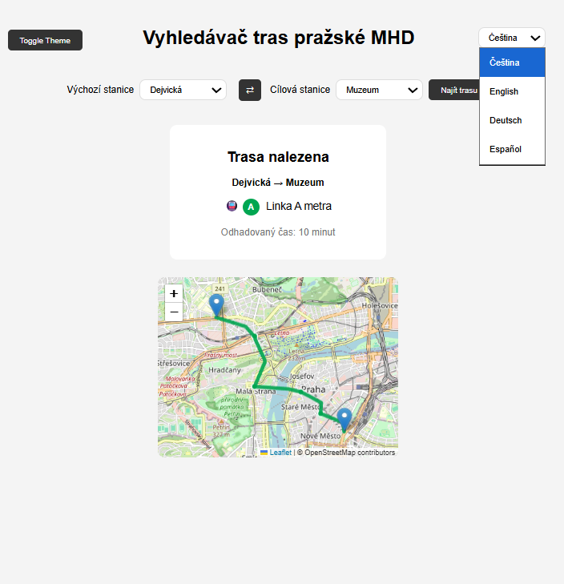

<link rel="preconnect" href="https://fonts.googleapis.com">
<link rel="preconnect" href="https://fonts.gstatic.com" crossorigin>
<link href="https://fonts.googleapis.com/css2?family=Spline+Sans:wght@300..700&display=swap" rel="stylesheet">

# Visual

### Live Demo

Open the interactive route demo:

<a href="interface.html" class="demo-button">Open Transit Demo</a>

---

### Source Code

[View the GitHub Repository](https://github.com/arelyjacobo/transit-route-demo)

---

### Built With

- HTML
- CSS
- JavaScript
- Leaflet Maps
- OpenStreetMap

---

### Features

- Select start and destination stations from Prague Metro Line A
- Swap stations to quickly reverse the route
- Interactive map displaying the metro route across Prague
- Smooth animated route visualization along the line
- Intermediate station indicators between stops
- Metro-style colored route line
- Start and destination markers on the map
- Automatic travel time estimation between stations
- Multilingual interface (English, Czech, German, Spanish)
- Light / Dark theme toggle

---

### Purpose

This project explores frontend interface design for transit systems and map-based navigation tools inspired by Prague’s public transportation network.

The demo combines interactive mapping, route visualization, and multilingual UI design in a lightweight web application.